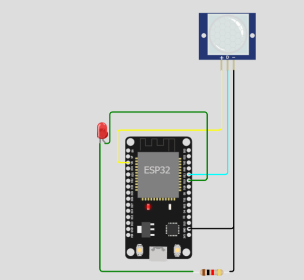
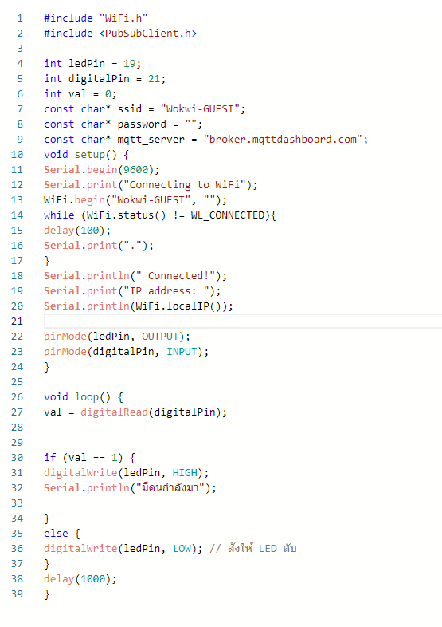
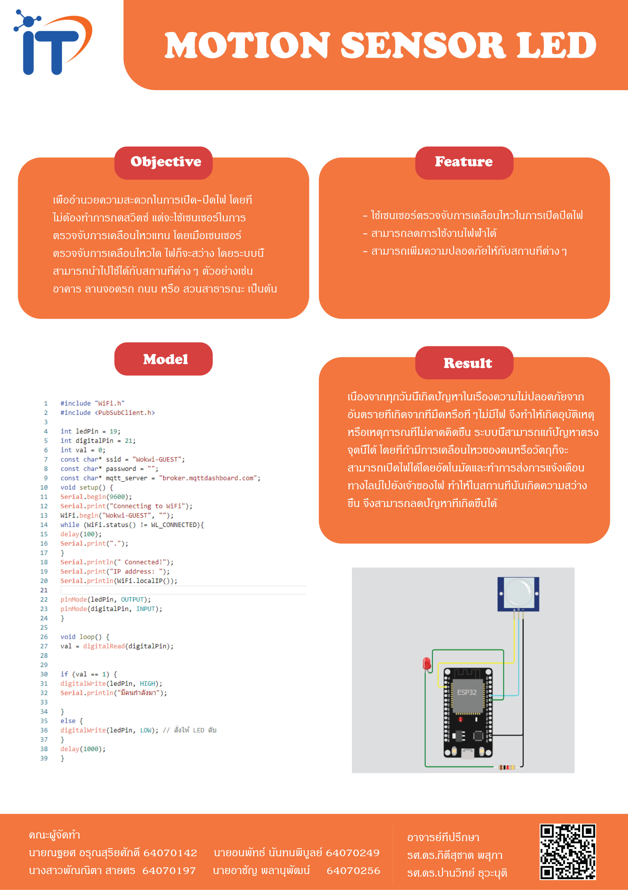

<!DOCTYPE html>
<html lang="en">
<head>
</head>
<body>
    <h1>เกี่ยวกับโปรเจค</h1>
    <h3>ชื่อโครงงาน</h3>
Motion Sensor LED

    <h3>ชนิดโครงงาน</h3>
Micro-controller

    
&nbsp&nbspโปรเจคนี้จัดทำขึ้นเพื่อ พัฒนาระบบการเปิด-ปิดไฟแบบอัตโนมัติโดยใช้อุปกรณ์ไมโครคอนโทรเลอร์ ESP32 และ PIR Motion Sensor
        ซึ่งเป็นเซนเซอร์ที่ใช้ตรวจจับการเคลื่อนไหว โดยเมื่อเซนเซอร์ตรวจพบวัตถุผ่านแล้วจะทำการเปิดไฟอัตโนมัติไม่ต้องไปทำการกดสวิตซ์ จะช่วยเพิ่มความสะดวกสบายให้กับผู้ใช้ 
        ช่วยลดพลังงานไฟฟ้าเนื่องจากไม่ต้องทำการเปิดไฟตลอดเวลา และยังสามารถนำไปใช้กับสถานที่ต่างๆได้อีกด้วย
    

    <h3>คุณสมบัติ</h3>
    
- ใช้เซนเซอร์ตรวจจับการเคลื่อนไหวในการเปิด-ปิดไฟ

    <h3>ประโยชน์</h3>
    
- เพิ่มความสะดวกสบายในการเปิด-ปิดไฟ

    
- ช่วยลดพลังงานไฟฟ้าได้

    
- สามารถเพิ่มความปลอดภัยให้กับสถานที่ต่างๆได้

    <h3>อุปกรณ์</h3>
    
1. ESP32 1 ตัว

    
2. Pir Motion Sensor 1 ตัว

    
3. LED 1 ตัว

    
4. Resistor 1 ตัว

    <h3>หลักการทำงาน</h3>
    
&nbsp&nbspเมื่อมีวัตถุผ่านเข้ามาบริเวณที่มีเซนเซอร์จับการเคลื่อนไหว เซนเซอร์จะทำหน้าที่ส่งข้อมูลเพื่อให้ไฟติด
       เมื่อวัตถุเคลื่อนออกจากบริเวณนั้นไปเซนเซอร์จะส่งข้อมูลไปเพื่อทำให้ไฟดับ 
    

    
    <h3>ลิ้งการทำงานของวงจร</h3>
    <a href="https://wokwi.com/projects/330931697194369619">https://wokwi.com/projects/330931697194369619</a>
    <h3>โค้ด</h3>
    
    <h3>โปสเตอร์</h3>
    
    <h3>วีดีโอสาธิตการใช้งาน</h3>
    <a href="https://drive.google.com/file/d/1Onj4AduYuwJRiIOvTeiGNu9y_-O6NPuY/view?usp=sharing">Motion Sensor LED</a>
    <h3>สมาชิก</h3>
    
นายณฐยศ อรุณสุริยศักดิ์ 64070142

    
นางสาวพัณณิตา สายศร  64070197

    
นายอนพัทธ์ นันทนพิบูลย์ 64070249

    
นายอาชัญ พลานุพัฒน์   64070256

</body>
</html>
